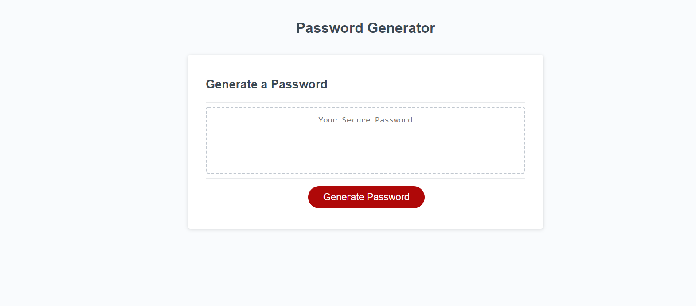

PASSWORD GENERATOR

Description: A password is randomly generated based on criteria that the user provides when prompted. The password can include numbers, characters, uppercase and lowercase letters. The password lenght must be between 8-128.
When all parameters have been defined, the password will appear within the password box.

Technologies Used: HTML5, CSS3, JavaScript

